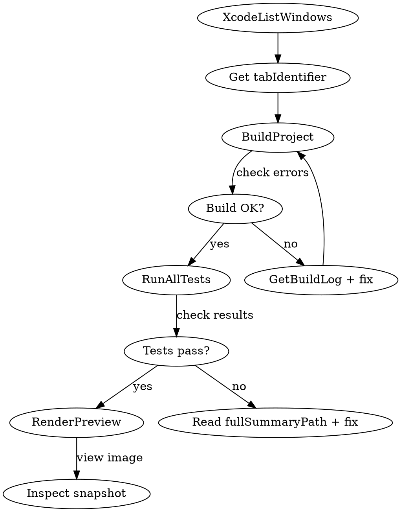

# macOS SwiftUI Development

Independent build, test, debug, and accessibility workflow for macOS SwiftUI apps — without requiring human interaction with the GUI.

## Xcode MCP Bridge

The primary tool for independent app testing. Requires Xcode running with the project open.

**Setup** (one-time, per project):
```json
// .mcp.json at project root
{ "mcpServers": { "xcode": { "command": "xcrun", "args": ["mcpbridge"] } } }
```
Or globally: `claude mcp add --transport stdio xcode -- xcrun mcpbridge`

Xcode must have MCP enabled: Xcode > Settings > Intelligence > Model Context Protocol > Xcode Tools: ON.

### Key Xcode MCP Tools

| Tool | Use for |
|---|---|
| `BuildProject` | Build and get errors/warnings with line numbers |
| `RunAllTests` | Run full test suite via Xcode's test runner |
| `RunSomeTests` | Run specific tests by target + identifier |
| `GetTestList` | Discover available tests and their identifiers |
| `RenderPreview` | Render SwiftUI `#Preview` as image snapshot |
| `ExecuteSnippet` | Run arbitrary Swift code in context of any source file |
| `XcodeListNavigatorIssues` | Read Issue Navigator (errors, warnings, remarks) |
| `GetBuildLog` | Full build log, filterable by severity/pattern |
| `XcodeRefreshCodeIssuesInFile` | Get compiler diagnostics for a specific file |

All tools require a `tabIdentifier` — get it from `XcodeListWindows` first.

### Workflow: Build-Test-Inspect Loop



### RenderPreview — Visual Verification

Renders a `#Preview` macro as an image file. Use to verify UI without manually launching the app.

```
RenderPreview(tabIdentifier: "...", sourceFilePath: "Slideshow/Views/PreviewPanel.swift")
→ { previewSnapshotPath: "/tmp/preview-XXXX.png" }
```

Read the snapshot with the Read tool (it handles images). Check layout, colors, spacing.

### ExecuteSnippet — Runtime Probing

Run code in the context of any source file (access to its imports, types, even `fileprivate` decls):

```
ExecuteSnippet(
  tabIdentifier: "...",
  sourceFilePath: "Slideshow/Views/ContentView.swift",
  codeSnippet: "print(UTType(\"is.kte.slideshow\")?.description ?? \"nil\")"
)
```

Use for: validating type resolution, checking API availability, testing model logic in situ.

## CLI Tools (No Xcode MCP Needed)

These work without the MCP bridge — useful for CI or when Xcode isn't open.

### Build & Test

```bash
# SlideshowKit package tests (primary testable target)
cd SlideshowKit && swift test

# Single test
cd SlideshowKit && swift test --filter SidecarParserTests/parsesYAMLFrontmatter

# Full Xcode project build
xcodebuild -scheme Slideshow -destination 'platform=macOS' build

# Build with warnings as errors (strict check)
xcodebuild -scheme Slideshow -destination 'platform=macOS' build \
  OTHER_SWIFT_FLAGS="-warnings-as-errors"
```

### Performance Profiling (xctrace)

```bash
# Available instruments
xctrace list instruments  # Notable: Allocations, Leaks, SwiftUI

# Profile the running app for leaks (attach to PID)
xctrace record --instrument Leaks --attach $(pgrep -x Slideshow) \
  --time-limit 10s --output /tmp/trace.trace

# SwiftUI body evaluation profiling
xctrace record --instrument SwiftUI --attach $(pgrep -x Slideshow) \
  --time-limit 10s --output /tmp/swiftui.trace

# Export trace data as XML for analysis
xctrace export --input /tmp/trace.trace --xpath '/trace-toc/run/data/table'
```

### Code Intelligence (LSP)

SourceKit-LSP is available via the LSP tool for:
- Go to definition, find references, hover (type info)
- Document symbols, workspace symbol search
- Call hierarchy (incoming/outgoing calls)

## Accessibility Testing

### XCUITest Accessibility Audit (Recommended)

Write UI tests that call `performAccessibilityAudit()` (macOS 14+). Add a UI test target:

```swift
import XCTest

final class AccessibilityTests: XCTestCase {
    func testAccessibilityCompliance() throws {
        let app = XCUIApplication()
        app.launch()

        // Audit all accessibility issues
        try app.performAccessibilityAudit()
    }

    func testAccessibilityAuditWithExclusions() throws {
        let app = XCUIApplication()
        app.launch()

        // Exclude specific audit types if needed
        try app.performAccessibilityAudit(for: [
            .dynamicType, .contrast, .hitRegion,
            .sufficientElementDescription, .textClipped
        ])
    }
}
```

Run via: `xcodebuild test -scheme Slideshow -destination 'platform=macOS' -only-testing:SlideshowUITests/AccessibilityTests`

Or via Xcode MCP: `RunSomeTests(tabIdentifier: "...", tests: [{targetName: "SlideshowUITests", testIdentifier: "AccessibilityTests"}])`

### AppleScript UI Inspection (Requires Assistive Access)

If `osascript` has assistive access (System Settings > Privacy > Accessibility):

```bash
# List UI elements of the running app
osascript -e 'tell application "System Events" to tell process "Slideshow" to get entire contents of window 1'

# Check for accessibility labels
osascript -e 'tell application "System Events" to tell process "Slideshow" to get description of every UI element of window 1'
```

Check access: `AXIsProcessTrusted()` must return `true`. Grant via System Settings > Privacy & Security > Accessibility > add Terminal/osascript.

### SwiftUI Accessibility Modifiers

Ensure views use proper accessibility modifiers:

```swift
Image(nsImage: image)
    .accessibilityLabel("Slide: \(slide.displayName)")
    .accessibilityHint("Double tap to select")
    .accessibilityAddTraits(.isImage)

Button("Present") { ... }
    .accessibilityLabel("Start presentation")
    .keyboardShortcut("p", modifiers: [.command, .shift])
```

## Swift Agents (Optional Enhancement)

[swift-agents](https://github.com/Techopolis/swift-agents) provides 16 specialized review agents for Swift development — covering concurrency, accessibility, SwiftUI patterns, testing, security, and more. Install for automated review on every prompt:

```bash
curl -fsSL https://raw.githubusercontent.com/Techopolis/swift-agents/main/install.sh | bash
```

Key agents: `concurrency-specialist`, `mobile-a11y-specialist`, `swiftui-specialist`, `testing-specialist`, `performance-specialist`.

## Common Mistakes

| Mistake | Fix |
|---|---|
| MCP tools fail silently | Check `XcodeListWindows` first — Xcode must be running with project open |
| `RunAllTests` times out | Tests may hang on main actor; check for deadlocks in `@MainActor` code |
| `RenderPreview` error | Ensure `#Preview` macro exists in the file; check `previewDefinitionIndexInFile` |
| `AXIsProcessTrusted()` false | Grant assistive access in System Settings for Terminal/osascript |
| `xctrace` can't attach | App must be running; use `pgrep -x AppName` to find PID |
| Build succeeds but app crashes | Check `GENERATE_INFOPLIST_FILE: true` in project.yml; check entitlements |
