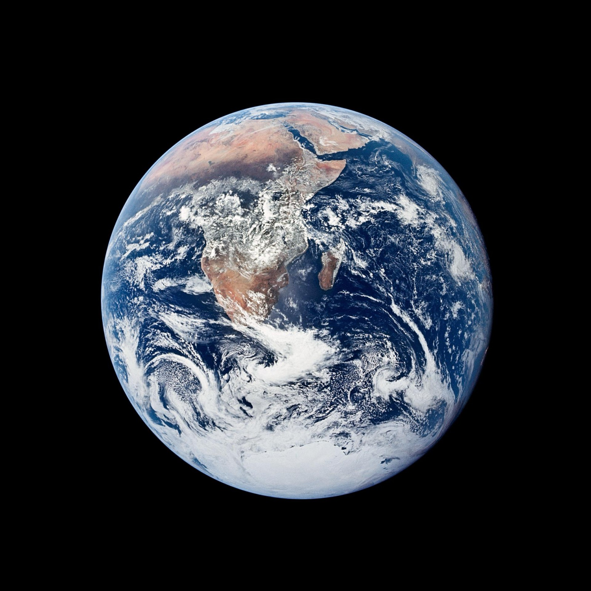
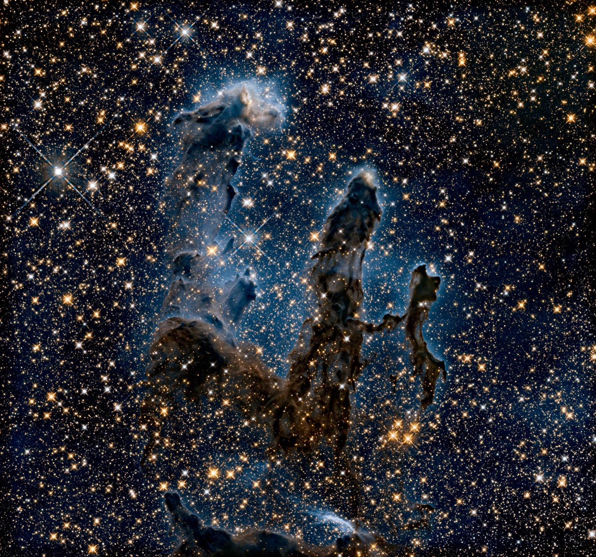
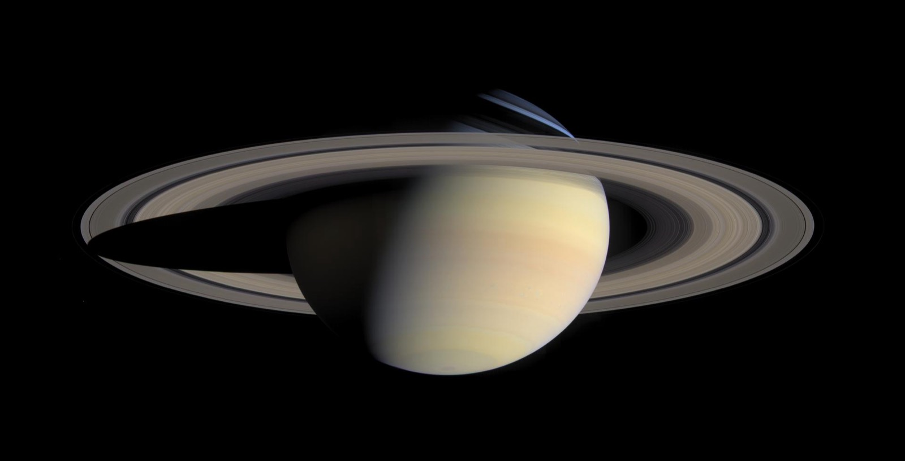
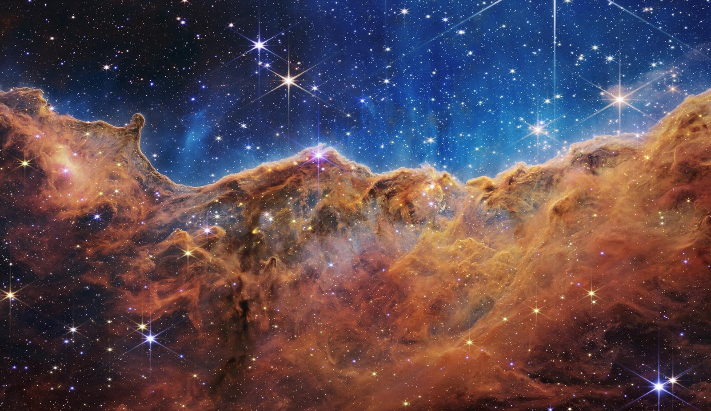
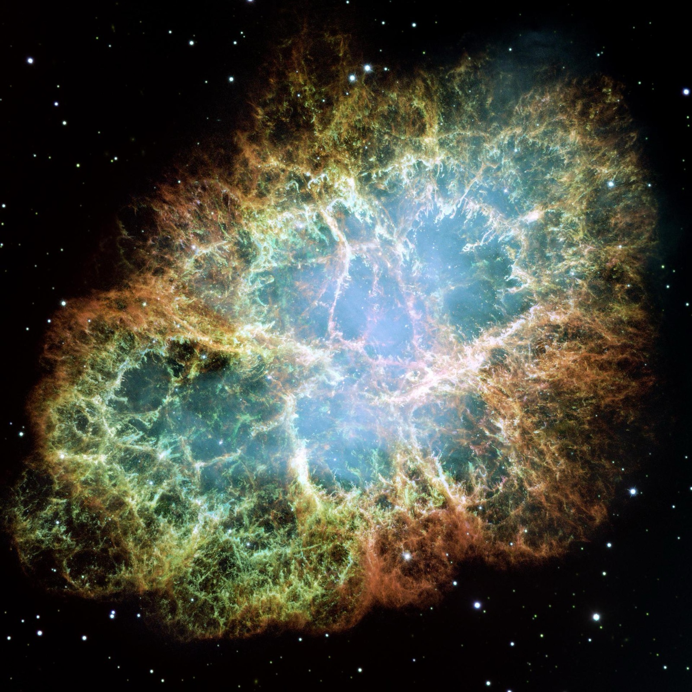
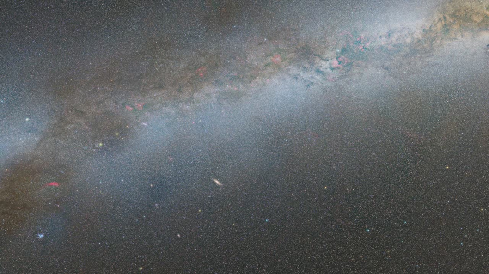
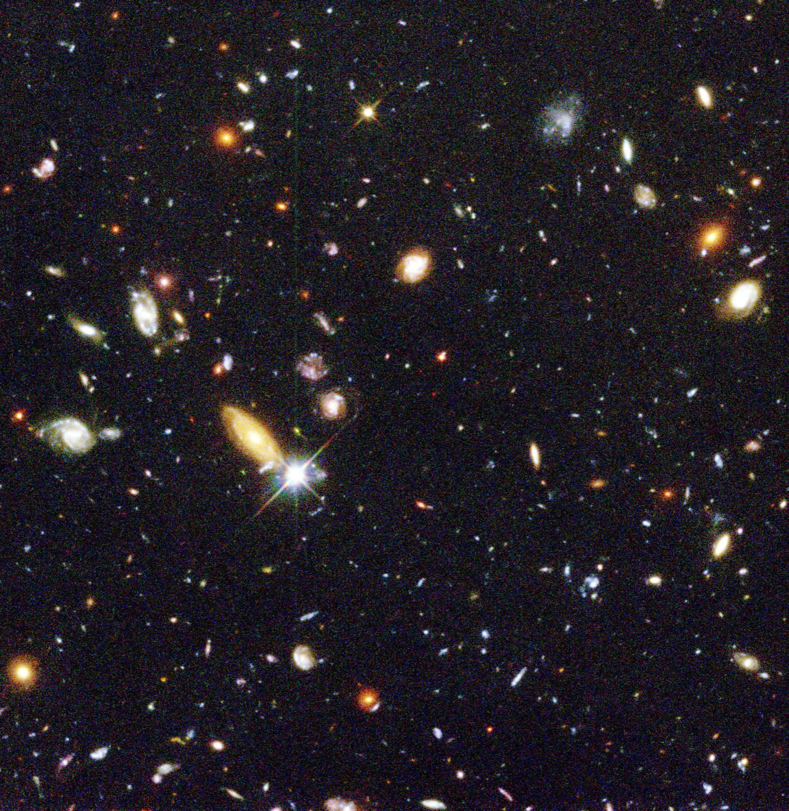
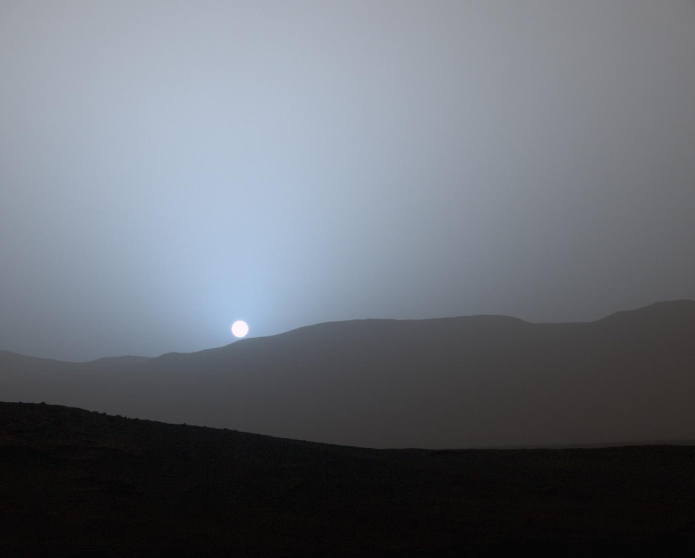
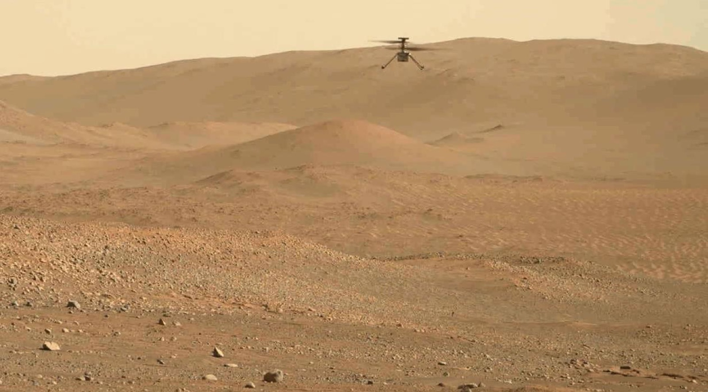
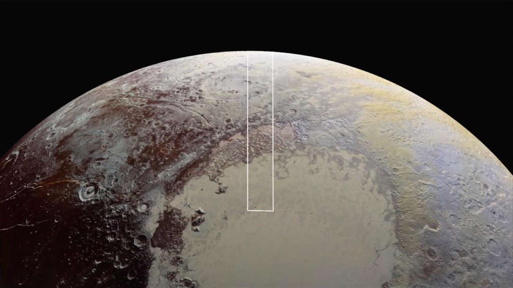

# My Favorite Space Pictures

---

### The Blue Marble

> NASA / Apollo 17 crew, 1972
> Public Domain

This is Earth from really far away — about 29,000 kilometers.
The Apollo 17 astronauts took this on December 7, 1972.
You can see Africa and Antarctica and the whole Indian Ocean.

It's one of the most copied photos ever. I think it's because
it's the first time people could see that Earth is actually round
and floating in nothing.

---

### Pillars of Creation

> NASA / ESA / Hubble Heritage Team
> Public Domain

These are called the Pillars of Creation and they're in the
Eagle Nebula. They're columns of gas and dust where new stars
are being born RIGHT NOW.

Each pillar is about 4 to 5 light-years tall. That means if you
could drive a car at highway speed, it would take you about
50 million years to get from the bottom to the top of one pillar.

---

### The Greatest Saturn Portrait

> NASA / JPL-Caltech / Space Science Institute / Cassini
> Public Domain

This is made of 126 separate photos stitched together by the
Cassini spacecraft in 2004. It shows the whole planet and all
its rings in real color.

Saturn's rings are mostly made of ice chunks — some as small
as grains of sand, some as big as houses. The rings are super
wide but really thin, like a DVD that's 100,000 kilometers across.

---

### Cosmic Cliffs

> NASA / ESA / CSA / STScI / James Webb Space Telescope
> Public Domain

This was the first picture from the James Webb Space Telescope
that made everyone go "whoa." It's the edge of a star nursery
in the Carina Nebula.

The "cliffs" are actually walls of gas and dust being eaten away
by radiation from baby stars. Webb can see through the dust
with infrared light, so it found stars that nobody had ever seen before.

---

### Crab Nebula

> NASA / ESA / Hubble Space Telescope
> Public Domain

In the year 1054, Chinese astronomers saw a new star appear in
the sky. It was so bright you could see it during the day for
three weeks. This is what's left of that explosion.

Hubble took 24 separate photos and stitched them together to make
this. In the middle there's a neutron star spinning 30 times per
second — it's the dead core of the star that exploded.

---

### Andromeda Galaxy

> NASA / ESA / Hubble Space Telescope
> Public Domain

This is the Andromeda Galaxy and it's heading straight toward us
at 110 kilometers per SECOND. Don't worry though — it won't get
here for another 4.5 billion years.

Hubble resolved over 100 million individual stars in this picture.
Andromeda is the farthest thing you can see with your naked eye
on a dark night — it's 2.5 million light-years away.

---

### Hubble Deep Field

> NASA / STScI / Hubble Space Telescope, 1996
> Public Domain

In 1996, scientists pointed Hubble at a tiny patch of sky that
looked completely empty — about the size of a tennis ball seen
from 100 meters away. They left the camera open for 10 days.

They found over 3,000 galaxies. Each galaxy has billions of stars.
Some of the light in this picture has been traveling for over
12 billion years. This one picture changed what we think about
how big the universe is.

---

### Sunset on Mars

> NASA / JPL-Caltech / MSSS / Curiosity Rover, 2015
> Public Domain

On Earth, sunsets are red and orange. On Mars, sunsets are BLUE.
This is because Mars dust is the right size to scatter blue light
forward toward the camera, which is the opposite of what happens
on Earth.

The Curiosity rover took this on April 15, 2015. It was the first
color sunset ever photographed on Mars. The Sun looks smaller
because Mars is farther away from it than we are.

---

### Ingenuity Helicopter on Mars

> NASA / JPL-Caltech / Perseverance Rover, 2023
> Public Domain

This is a helicopter. Flying on Mars. The air on Mars is only 1%
as thick as Earth's air, so the blades have to spin super fast —
about 2,400 revolutions per minute.

Ingenuity was only supposed to fly 5 times as a technology test.
It ended up flying 72 times over almost 3 years. It explored
places the rover couldn't reach and helped plan driving routes.

---

### Pluto Close-Up

> NASA / Johns Hopkins APL / SwRI / New Horizons, 2015
> Public Domain

Before New Horizons flew past in 2015, Pluto was just a blurry
dot. Nobody expected it to look like this — it has mountains
made of water ice, glaciers of frozen nitrogen, and a giant
heart-shaped plain.

The spacecraft had been flying for 9.5 years to get there. It
only had a few hours to take pictures because it was moving so
fast. These are some of the sharpest pictures of any world that
far from the Sun.

---
