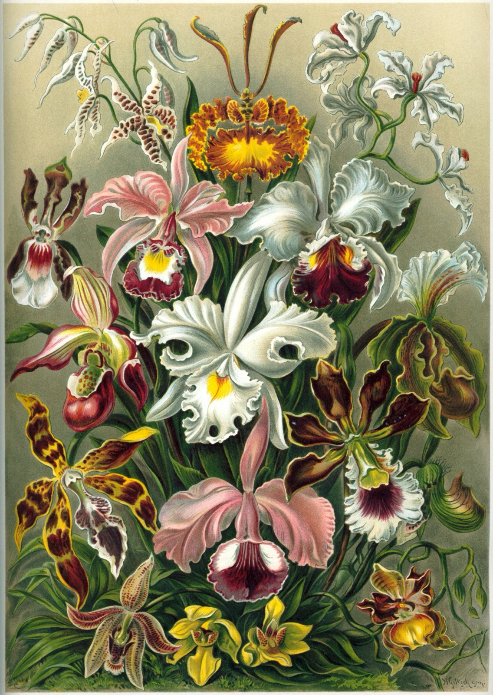
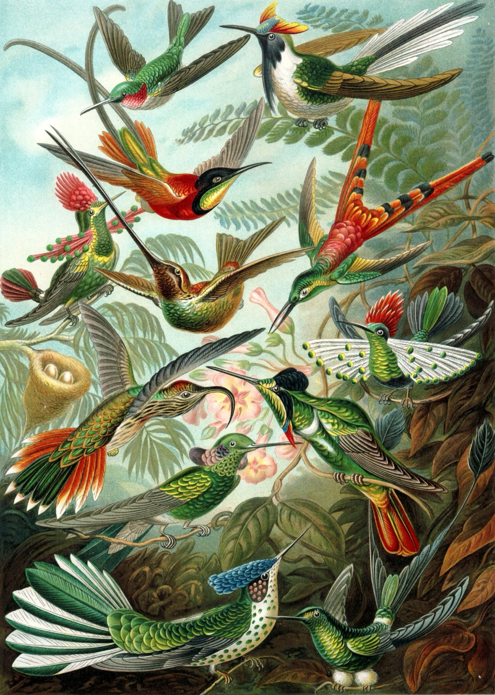
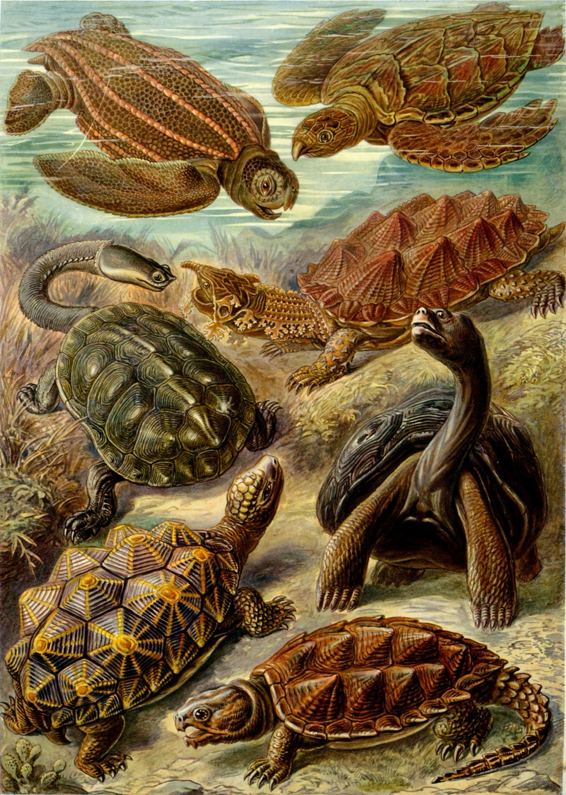

# Nature Is Really Good at Shapes

---

### Orchidae (Orchids)

> Ernst Haeckel, Kunstformen der Natur, Plate 74, 1904 Public Domain

Ernst Haeckel was a scientist who was also an incredible artist.
He traveled around the world studying nature and drawing everything
he saw. This plate shows different species of orchids.

Look at the symmetry — orchids have bilateral symmetry, which means
if you fold them in half they match up, just like your face.
Haeckel thought these shapes were so beautiful they proved that
nature is the best designer. He drew 100 plates like this.

---

### Trochilidae (Hummingbirds)

> Ernst Haeckel, Kunstformen der Natur, Plate 99, 1904 Public Domain

This is the last plate in the entire book — number 99 — and
Haeckel saved hummingbirds for the finale. Their feathers aren’t
actually colored. The iridescence comes from tiny structures in
the feathers that split light, like a prism.

Hummingbirds can fly backwards. Their hearts beat 1,200 times
per minute. They’re the smallest birds in the world but they
migrate thousands of kilometers. Haeckel picked them as the
grand finale because they’re basically nature showing off.

---

### Chelonia (Turtles)

> Ernst Haeckel, Kunstformen der Natur, Plate 89, 1904 Public Domain

Look at the shells. Turtles have HEXAGONS on their shells, and
hexagons are one of nature’s favorite shapes because they tile
perfectly — no gaps, no waste. Bees figured this out too.

Haeckel drew these to show how mathematical nature is. The shell
pattern is called tessellation, which is when shapes fit together
to cover a surface completely. Turtles have been around for over
200 million years — they’re older than dinosaurs, and their
geometry hasn’t changed because it already works perfectly.

---
