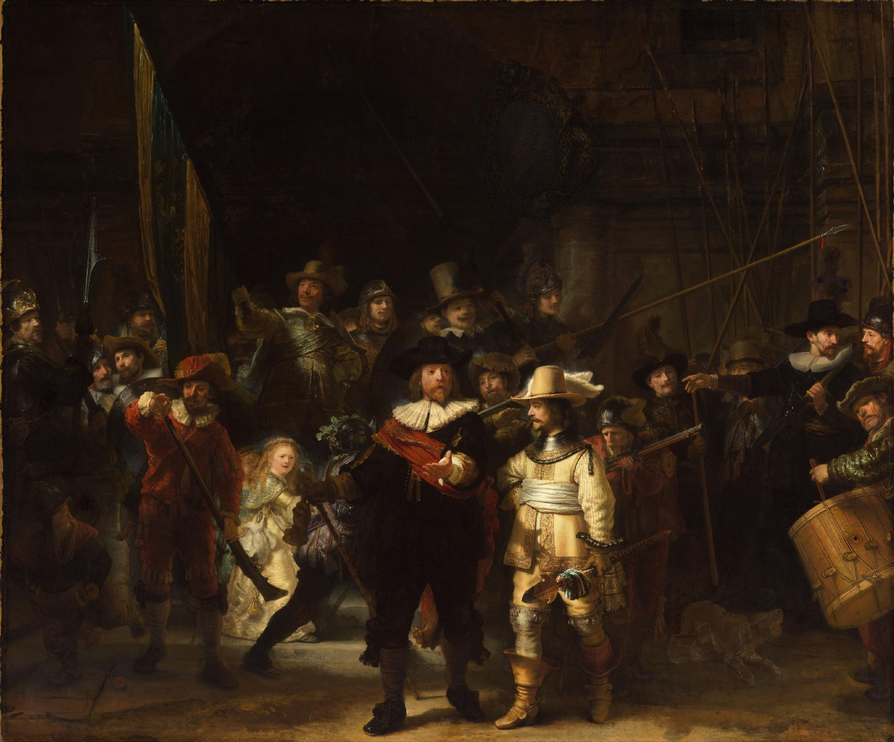
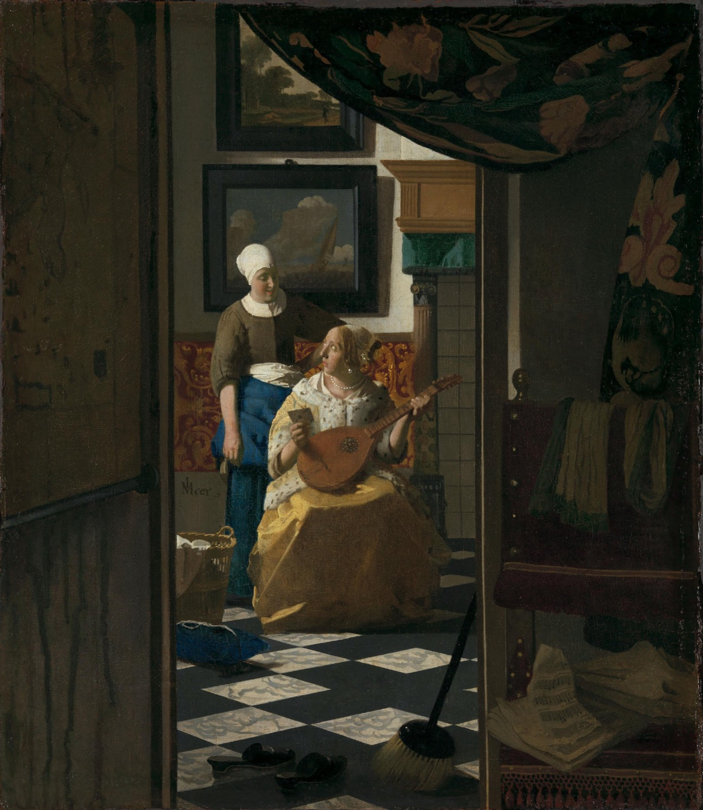
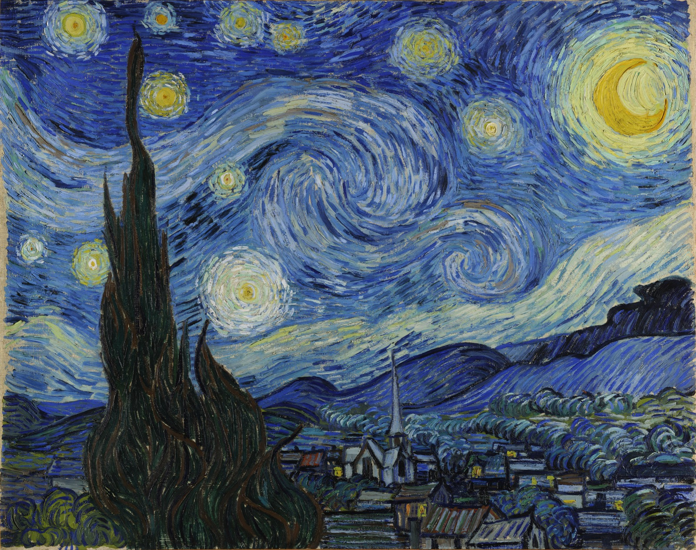

# Paintings That Tell Secrets

---

### The Night Watch

> Rembrandt van Rijn, 1642
> Rijksmuseum, Amsterdam — CC0 Public Domain

This painting is HUGE — 3.6 meters tall and 4.4 meters wide.
It shows a militia company, which is like a neighborhood army,
getting ready to march. But here's the secret: there's a little
girl in a golden dress near the middle that nobody can explain.

Rembrandt broke all the rules. Other group portraits were boring —
everyone standing in a row. He made it look like a movie scene
with dramatic light and people caught in the middle of moving.
The painting is so important it has its own room at the Rijksmuseum.

---

### The Love Letter

> Johannes Vermeer, c. 1669
> Rijksmuseum, Amsterdam — CC0 Public Domain

You're spying. Vermeer painted this so you're looking through a
doorway into a private moment — a woman has just received a
letter and she's looking at her maid like "what does it mean?"

The secret is on the wall behind them: there's a painting of a
ship on the sea, and in the 1600s, the sea was a metaphor for
love. Calm sea = love is going well. Stormy sea = uh oh.
Vermeer hid the answer to the letter in the background.

---

### The Starry Night

> Vincent van Gogh, 1889
> MoMA, New York — Public Domain

Van Gogh painted this from the window of an asylum in
Saint-Rémy-de-Provence, France. He had checked himself in
because he wasn't doing well. But look what came out of it —
the most famous painting of the night sky ever made.

The secret is that the sky is actually scientifically accurate
in a weird way. Scientists found that the swirling patterns
match something called turbulent flow in physics. Van Gogh
painted real math without knowing it.

---
